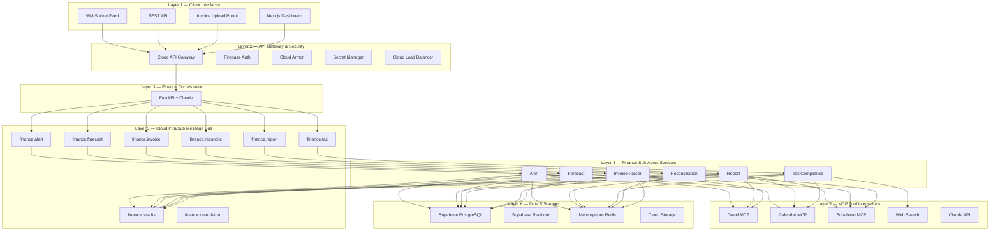

<br/><div align="center">

# FinancePilot

### Multi-Agent SME Financial Co-Pilot

**Full Architecture & Implementation Guide on Google Cloud**
**SE Asia Edition**

---

*Invoice Parser · Reconciliation · Tax Compliance · Forecast · Report · Alert Agents*
*Gmail MCP · Calendar MCP · Supabase MCP · Web Search · Vertex AI · Cloud Run*

---

**Document Version:** 1.0
**Last Updated:** April 2026
**Classification:** Internal — Technical Architecture Reference

</div>

---

## Table of Contents

1. [Executive Summary](#01--executive-summary)
2. [System Architecture](#02--system-architecture)
3. [Agent Architecture](#03--agent-architecture)
4. [Database Design](#04--database-design)
5. [API Design](#05--api-design)
6. [Google Cloud Deployment](#06--google-cloud-deployment)
7. [Repository Structure](#07--repository-structure)
8. [Core System Workflows](#08--core-system-workflows)
9. [Implementation Phases](#09--implementation-phases)
10. [Cost Estimate & Future Roadmap](#10--cost-estimate--future-roadmap)

---

## 01 — Executive Summary

### Project Overview

**FinancePilot** is a production-grade multi-agent AI system that automates the full financial operations lifecycle for SE Asian SMEs: invoice ingestion, bank reconciliation, tax compliance, cash flow forecasting, and board reporting. It runs entirely on Google Cloud, integrates four MCP servers, and produces real auditable financial outputs — not just text summaries.

> [!IMPORTANT]
> **APAC Impact:** SE Asia has **70M+ SMEs**, most of which run their finances in spreadsheets with zero automation. FinancePilot directly addresses a **$12B+** addressable market with a working, demo-able AI system.

### Architectural Advantages

| Differentiator | Description |
|:---|:---|
| **End-to-End Automation** | From raw email invoice to reconciled ledger entry to tax-filed calendar event — all automated. |
| **Every MCP Tool Used Meaningfully** | Gmail for invoice ingestion, Calendar for tax deadlines, Supabase for ledger ops, Web Search for live tax rules. |
| **Multi-Agent Parallelism** | Three agents run simultaneously on a single invoice event — visually demonstrable in the dashboard. |
| **Google Cloud Native** | Cloud Run, Pub/Sub, Cloud Scheduler, Memorystore, API Gateway — all managed, all scalable. |
| **Financial Audit Trail Built-In** | Every agent action logged to Supabase for compliance — real-world thinking, fully transparent. |
| **Supabase Double Integration** | Used as both the primary database AND as an MCP server — maximum technical depth. |

### System Capabilities Map

| Capability | How FinancePilot Addresses It | Impact |
|:---|:---|:---:|
| Primary agent coordinates sub-agents | Finance Orchestrator decomposes every request into Invoice / Reconcile / Tax / Forecast subtasks and routes via Pub/Sub | ✅ **STRONG** |
| Structured database storage | Supabase with 10 financial tables: invoices, transactions, vendors, ledger, forecasts, tax_records, audit_logs | ✅ **STRONG** |
| Multiple MCP integrations | Gmail MCP + Calendar MCP + Supabase MCP + Web Search — all in one workflow | ✅ **STRONG** |
| Multi-step workflow execution | Invoice email → parse → reconcile → tax check → forecast update → report email: 7 steps, 4 agents | ✅ **STRONG** |
| API-based deployment | 8 Cloud Run services, Cloud API Gateway, REST + WebSocket endpoints, CI/CD via Cloud Build | ✅ **STRONG** |
| Real-world use case | 70M+ SE Asian SMEs, $12B market, zero current automation — immediately commercially viable | ✅ **STRONG** |

---

## 02 — System Architecture

> *Google Cloud infrastructure, all 8 layers, service topology.*

### Architecture Philosophy

FinancePilot is built on the principle that **financial data is sacred**:

- Every agent action is **immutably logged** to Supabase.
- **No state lives in agent processes** — all state lives in Redis (ephemeral) or Supabase (permanent).
- Every external call goes through **Secret Manager**.
- This architecture is both **technically impressive** and **compliance-ready**.

### 8-Layer Architecture Overview



---

### Layer 1 — Client Interfaces

The system exposes four interfaces:

| Interface | Description |
|:---|:---|
| **Finance Dashboard** | Next.js dashboard with live charts (P&L, cash flow, AR aging), invoice list, reconciliation status, and tax calendar. |
| **Invoice Upload** | Drag-and-drop PDF/image upload, preview before processing, batch upload support. |
| **REST API** | `POST /invoices`, `GET /ledger`, `GET /forecast`, `GET /reports` — for ERP system integration. |
| **WebSocket Feed** | Real-time agent activity — what each agent is doing right now — excellent for system observability. |

### Layer 2 — API Gateway & Security

| Service | Purpose | GCP Product |
|:---|:---|:---|
| Cloud API Gateway | Request routing, rate limiting (100 req/min), financial API versioning | API Gateway |
| Firebase Auth | JWT issuance, Google OAuth2, multi-tenant SME isolation — each company sees only their data | Firebase |
| Cloud Armor | DDoS protection — mandatory for any fintech application handling monetary data | Cloud Armor |
| Secret Manager | All credentials: Gemini API key, Supabase URL/keys, OAuth tokens, tax API keys | Secret Manager |
| Cloud Load Balancer | Global HTTPS termination, automatic SSL, health checks across all Cloud Run regions | Load Balancing |

### Layer 3 — Finance Orchestrator

The Finance Orchestrator is a **FastAPI application** powered by Claude with financial domain expertise baked into its system prompt. It understands accounting concepts, SE Asian tax jurisdictions (GST Singapore, PPN Indonesia, VAT Thailand/Philippines), and common SME financial workflows.

On each request, the orchestrator runs a **two-phase Claude call**:

```
┌─────────────────────────────────────────────────────────────────────┐
│                     ORCHESTRATOR PIPELINE                          │
├─────────────────────────────────────────────────────────────────────┤
│                                                                     │
│  ① Financial Intent Analysis                                       │
│     Identifies what financial operation is needed                   │
│     (invoice processing / reconciliation / tax / forecast / report) │
│                                                                     │
│  ② Task Decomposition                                              │
│     Breaks the intent into subtasks mapped to specific agents       │
│                                                                     │
│  ③ Parallel Dispatch                                               │
│     Publishes all subtasks to Pub/Sub topics simultaneously         │
│     Agents run in parallel                                          │
│                                                                     │
│  ④ Result Synthesis                                                │
│     Calls Claude again to produce a clean financial summary         │
│     with action items                                               │
│                                                                     │
└─────────────────────────────────────────────────────────────────────┘
```

> [!IMPORTANT]
> **Critical Differentiator:** The orchestrator never hardcodes financial rules. It calls Claude with live context from Supabase + web search results to reason about current tax rates and regulations — making it genuinely adaptive to regulatory changes.

### Layer 4 — Finance Sub-Agent Services

| Agent | Pub/Sub Topic | Primary MCP Tools | Cloud Run Service |
|:---|:---|:---|:---|
| 📨 Invoice Parser Agent | `finance.invoice` | Gmail MCP (`fetch_email`, `get_attachment`) | `invoice-parser-svc` |
| 🔄 Reconciliation Agent | `finance.reconcile` | Supabase MCP (`query_database`, `update_record`) | `reconciliation-svc` |
| 🧾 Tax Compliance Agent | `finance.tax` | Web Search + Calendar MCP (`create_event`) | `tax-compliance-svc` |
| 📈 Forecast Agent | `finance.forecast` | Supabase MCP (`run_analytics`, `query_database`) | `forecast-agent-svc` |
| 📄 Report Agent | `finance.report` | Gmail MCP (`send_email`) + Supabase MCP | `report-agent-svc` |
| 🔔 Alert Agent | `finance.alert` | Calendar MCP + Gmail MCP | `alert-agent-svc` |

### Layer 5 — Cloud Pub/Sub Message Bus

All inter-agent communication flows through Cloud Pub/Sub. This means agents:
- **Never directly call** each other
- Have **no awareness** of each other's existence
- Can **fail and restart independently** without affecting the rest of the system

| Topic | Purpose |
|:---|:---|
| `finance.invoice` | Triggers Invoice Parser Agent when new invoice detected |
| `finance.reconcile` | Triggers Reconciliation Agent with invoice ID and bank statement window |
| `finance.tax` | Triggers Tax Compliance Agent with transaction details and jurisdiction |
| `finance.forecast` | Triggers Forecast Agent to update cash flow model with new data |
| `finance.report` | Triggers Report Agent to generate and email periodic summaries |
| `finance.alert` | Triggers Alert Agent for deadline notifications and anomaly warnings |
| `finance.results` | All agents publish results here; Orchestrator subscribes to aggregate |
| `finance.dead-letter` | Failed messages after 5 retries routed here for inspection and replay |

### Layer 6 — Data & Storage

| Store | Financial Data Stored | Access Pattern |
|:---|:---|:---|
| **Supabase PostgreSQL** | Invoices, transactions, vendors, accounts, ledger entries, tax records, forecasts, audit_logs | Agent CRUD via Supabase MCP + direct SDK calls |
| **Supabase Realtime** | Live subscription: P&L updates, reconciliation status, new invoice events pushed to dashboard | WebSocket push from DB triggers to frontend |
| **Memorystore Redis** | Orchestrator session state, agent working memory, exchange rate cache (TTL 15min), rate limit counters | Sub-ms reads for hot financial data paths |
| **Cloud Storage** | Invoice PDFs, bank statement files, generated report PDFs, export CSVs, audit archive | Signed URL access, lifecycle policies for compliance |

### Layer 7 — MCP Tool Integrations

| MCP Server | Tools Used in FinancePilot | Agent Consumer |
|:---|:---|:---|
| **Gmail MCP** | `fetch_emails` (invoice detection), `get_attachment` (PDF download), `send_email` (reports + alerts), `create_draft` | Invoice Parser, Report, Alert Agents |
| **Google Calendar MCP** | `create_event` (tax deadlines, payment dates), `list_events` (upcoming financial dates), `update_event` | Tax Compliance, Alert Agents |
| **Supabase MCP** | `query_database` (ledger queries), `insert_record` (new invoices), `update_record` (reconciliation), `run_analytics` (forecasts) | Reconciliation, Forecast, Report Agents |
| **Web Search Tool** | `search` (GST/VAT rates by jurisdiction), `fetch_url` (tax authority pages), `search` (exchange rates) | Tax Compliance Agent |
| **Claude API (Vertex AI)** | LLM inference for all 6 agents — financial reasoning, document parsing, report writing, anomaly detection | All Agents |

---

## 03 — Agent Architecture

> *All 6 finance agents — specs, prompts, tool configs, and code patterns.*

### Finance Orchestrator — Full Specification

The orchestrator is a FastAPI service with Claude configured with a financial domain system prompt. It is the **only entry point** into the agent network — all user requests and all automated triggers (Gmail push, Cloud Scheduler) hit the orchestrator first.

#### Orchestrator System Prompt

```
You are FinancePilot Orchestrator, a financial AI coordinator for SE Asian SMEs.

You have deep knowledge of:
  - Bookkeeping and double-entry accounting
  - GST (Singapore), PPN (Indonesia), VAT (Thailand/Philippines)
  - Cash flow management and invoice processing
  - SE Asian SME financial workflows

Your ONLY job is to analyze financial requests and decompose them into subtasks
for specialized agents.

Available agents:
  - invoice_parser_agent
  - reconciliation_agent
  - tax_compliance_agent
  - forecast_agent
  - report_agent
  - alert_agent

Rules:
  ✗ Never execute financial operations yourself.
  ✓ Always return a JSON task plan with agent assignments,
    required data, and priority order.
```

#### Orchestrator Code Structure

```python
# orchestrator/main.py — FinancePilot Primary Orchestrator

from fastapi import FastAPI, Depends, BackgroundTasks
from google import genai
from google.cloud import pubsub_v1
import asyncio, json

app = FastAPI(title="FinancePilot Orchestrator")
client = genai.Client()

# Core orchestration: decompose → dispatch → collect → synthesize
async def process_financial_request(
    message: str, company_id: str, session_id: str
) -> dict:

    # 1. Analyze financial intent
    plan = await decompose_financial_task(message, company_id)

    # 2. Dispatch all subtasks in parallel via Pub/Sub
    dispatches = [
        publish_to_agent(subtask, session_id)
        for subtask in plan["subtasks"]
    ]
    await asyncio.gather(*dispatches)

    # 3. Collect results (Redis-based, timeout=45s for finance ops)
    results = await collect_agent_results(
        session_id, expected_count=len(plan["subtasks"])
    )

    # 4. Synthesize financial summary with Claude
    return await synthesize_financial_response(message, results)
```

---

### Finance Sub-Agents — Full Specifications

#### 📨 Invoice Parser Agent

**The entry point for all invoice processing.**

| Attribute | Detail |
|:---|:---|
| **Pub/Sub Topic** | `finance.invoice` |
| **Cloud Run Service** | `invoice-parser-svc` |
| **Resources** | 2 CPU, 2Gi RAM (Claude vision is compute-intensive) |
| **MCP Tools** | Gmail MCP: `fetch_emails`, `get_attachment`, `mark_read` · Claude vision: document parsing |

**Workflow:**
1. Monitors Gmail inbox via MCP push notifications for new invoice emails.
2. Downloads PDF/image attachments.
3. Uses Claude's document understanding to extract:
   - Vendor name, vendor tax ID, invoice number
   - Issue date, due date
   - Line items with descriptions, unit prices, and quantities
   - Subtotal, tax amount, total amount, payment currency
4. Validates extracted data against known vendor records in Supabase.
5. Writes structured invoice record to Supabase `invoices` table.
6. Publishes to `finance.reconcile` to trigger Reconciliation Agent.

---

#### 🔄 Reconciliation Agent

**Automated bank statement matching with confidence scoring.**

| Attribute | Detail |
|:---|:---|
| **Pub/Sub Topic** | `finance.reconcile` |
| **Cloud Run Service** | `reconciliation-svc` |
| **Resources** | 1 CPU, 1Gi RAM |
| **MCP Tools** | Supabase MCP: `query_database`, `update_record`, `insert_record` · Redis: session working memory |

**Workflow:**
1. Receives invoice ID from Pub/Sub.
2. Fetches the invoice from Supabase.
3. Queries bank transactions table for matching entries within a **30-day window** using Supabase MCP.
4. Applies fuzzy matching:
   - **Exact amount match**
   - **Approximate amount match** (±2% for exchange rate variance)
   - **Vendor name match**
5. Assigns confidence score (0–100) to each potential match.

**Confidence Thresholds:**

| Score | Action |
|:---:|:---|
| **> 90** | Auto-reconciles and updates both records |
| **50 – 90** | Flags for human review with top 3 candidates |
| **< 50** | Marks as unmatched, triggers Alert Agent |

6. Writes reconciliation record to `ledger` table.

---

#### 🧾 Tax Compliance Agent

**Multi-jurisdiction tax calculation and deadline management.**

| Attribute | Detail |
|:---|:---|
| **Pub/Sub Topic** | `finance.tax` |
| **Cloud Run Service** | `tax-compliance-svc` |
| **Resources** | 1 CPU, 1Gi RAM |
| **MCP Tools** | Web Search: GST/VAT rules · Calendar MCP: `create_event`, `update_event` · Supabase MCP: `query_database` |

**Supported Jurisdictions:**

| Country | Tax Type | Rate |
|:---|:---|:---:|
| Singapore | GST | 9% |
| Indonesia | PPN | 11% |
| Thailand | VAT | 7% |
| Philippines | VAT | 12% |
| Malaysia | SST | 6–10% |
| Vietnam | VAT | 10% |

**Workflow:**
1. Receives transaction details and company jurisdiction from Pub/Sub.
2. Searches the web for current GST/VAT rate for the vendor's category in the company's jurisdiction.
3. Calculates input tax credit eligibility.
4. Checks if the quarter's tax filing deadline is already in Google Calendar via Calendar MCP — if not, creates it.
5. Calculates cumulative tax liability for the current period from Supabase.
6. Flags if approaching the VAT registration threshold for the jurisdiction.
7. Writes `tax_records` entry to Supabase.

---

#### 📈 Forecast Agent

**Three-scenario cash flow projection engine.**

| Attribute | Detail |
|:---|:---|
| **Pub/Sub Topic** | `finance.forecast` |
| **Cloud Run Service** | `forecast-agent-svc` |
| **Resources** | 1 CPU, 1Gi RAM |
| **MCP Tools** | Supabase MCP: `run_analytics`, `query_database` · Redis: model cache (TTL 1hr) |

**Workflow:**
1. Triggered by any new financial event (invoice, payment, bank transaction).
2. Fetches last 90 days of transactions from Supabase via MCP.
3. Calculates:
   - **AR aging buckets** (current, 30, 60, 90+ days)
   - **AP payment schedule** (upcoming payments by due date)
   - **Monthly burn rate** trend
   - **Current cash runway**
4. Builds three scenarios:

| Scenario | Basis |
|:---|:---|
| **Conservative** | Worst-case collection assumptions |
| **Base** | Historical average performance |
| **Optimistic** | 100% on-time collection |

5. Caches projection in Redis (TTL: 1 hour).
6. Writes updated forecast to Supabase `forecasts` table.
7. Triggers dashboard Realtime update.

---

#### 📄 Report Agent

**Automated financial report generation and distribution.**

| Attribute | Detail |
|:---|:---|
| **Pub/Sub Topic** | `finance.report` |
| **Cloud Run Service** | `report-agent-svc` |
| **Resources** | 1 CPU, 1Gi RAM |
| **MCP Tools** | Gmail MCP: `send_email`, `create_draft` · Supabase MCP: `query_database`, `run_analytics` |

**Workflow:**
1. Generates formatted financial reports on schedule (daily digest, weekly P&L, monthly board summary) or on-demand via user request.
2. Queries Supabase via MCP for relevant period data.
3. Uses Claude to write the narrative sections (commentary on variance, highlights, risks).
4. Formats as structured email with key metrics table.
5. Sends via Gmail MCP to the configured stakeholder list.

**Monthly Board Report Structure:**
- Executive Summary
- P&L Table
- Cash Flow Chart Description
- Top 5 Vendors by Spend
- 90-Day Forecast Snapshot

---

#### 🔔 Alert Agent

**Proactive financial monitoring and notification system.**

| Attribute | Detail |
|:---|:---|
| **Pub/Sub Topic** | `finance.alert` |
| **Cloud Run Service** | `alert-agent-svc` |
| **Resources** | 1 CPU, 512Mi RAM |
| **MCP Tools** | Calendar MCP: `create_event`, `list_events` · Gmail MCP: `send_email` · Anomaly detection module |

**Monitored Conditions:**

| Trigger | Threshold |
|:---|:---|
| Invoice overdue | > 7 days past due |
| Reconciliation unmatched | > 3 days unmatched |
| Cash runway critically low | < 60 days remaining |
| Unusual transaction | > 3× average transaction amount |
| Tax filing deadline approaching | Within 14 days |

**Workflow:**
1. For each trigger: creates a Google Calendar event with the deadline via Calendar MCP.
2. Sends a prioritized alert email via Gmail MCP to the relevant stakeholder.
3. Runs a **daily anomaly scan**: compares transaction patterns against 90-day baseline and flags outliers for human review.

---

## 04 — Database Design

> *Full Supabase schema for financial operations with RLS and audit trail.*

### Supabase PostgreSQL Schema — 10 Core Tables

| Table | Key Columns | Financial Purpose |
|:---|:---|:---|
| `companies` | `id`, `name`, `jurisdiction`, `gst_number`, `bank_account_id`, `created_at` | Multi-tenant root — every table FK to this |
| `vendors` | `id`, `company_id`, `name`, `tax_id`, `email`, `country`, `gst_registered`, `avg_payment_days` | Vendor master data; GST status for tax agent |
| `invoices` | `id`, `company_id`, `vendor_id`, `invoice_number`, `issue_date`, `due_date`, `subtotal`, `tax_amount`, `total`, `currency`, `status`, `pdf_url`, `raw_json`, `parsed_by_agent` | Core invoice table; `raw_json` = Claude extraction output |
| `bank_transactions` | `id`, `company_id`, `date`, `description`, `amount`, `currency`, `balance`, `category`, `reconciled_invoice_id`, `confidence_score` | Bank statement data; reconciled when matched to invoice |
| `ledger_entries` | `id`, `company_id`, `date`, `account_code`, `description`, `debit`, `credit`, `running_balance`, `source_invoice_id`, `source_transaction_id` | Double-entry accounting ledger |
| `tax_records` | `id`, `company_id`, `period_start`, `period_end`, `jurisdiction`, `tax_type`, `gross_amount`, `tax_rate`, `tax_amount`, `input_credit`, `net_payable`, `filing_deadline`, `status` | Tax liability tracking per jurisdiction per period |
| `forecasts` | `id`, `company_id`, `generated_at`, `horizon_days`, `conservative_runway`, `base_runway`, `optimistic_runway`, `ar_aging_json`, `ap_schedule_json`, `assumptions_json` | Cash flow forecast snapshots from Forecast Agent |
| `agent_audit_log` | `id`, `company_id`, `session_id`, `agent_name`, `action`, `input_summary`, `output_summary`, `tool_calls_json`, `duration_ms`, `tokens_used`, `created_at` | Immutable audit trail — every agent action recorded |
| `alerts` | `id`, `company_id`, `alert_type`, `severity`, `message`, `related_invoice_id`, `calendar_event_id`, `email_sent_at`, `resolved_at` | Alert history with resolution tracking |
| `report_history` | `id`, `company_id`, `report_type`, `period`, `recipient_emails`, `subject`, `sent_at`, `supabase_storage_url` | Record of all reports generated and emailed |

### Row Level Security (RLS) Policies

Every table has RLS enabled with a policy that restricts access to the authenticated user's company only. This is **critical for multi-tenant financial data security**.

```sql
-- RLS policy example (applied to ALL tables)
ALTER TABLE invoices ENABLE ROW LEVEL SECURITY;

CREATE POLICY "company_isolation" ON invoices
  FOR ALL USING (
    company_id = (
      SELECT company_id FROM users
      WHERE auth_uid = auth.uid()
    )
  );
```

> [!CAUTION]
> RLS must be enabled on **every table** before production deployment. Agent service-role keys bypass RLS for internal writes, but all frontend/API access is strictly scoped to the authenticated company.

### Redis Key Patterns (Memorystore)

| Key Pattern | Value | TTL |
|:---|:---|:---:|
| `session:{session_id}:finance_plan` | JSON: task plan, agent assignments, collected results | 30 min |
| `session:{session_id}:result:{agent}` | JSON: individual agent result | 30 min |
| `cache:forecast:{company_id}` | JSON: latest cash flow projection | 1 hr |
| `cache:exchange:{from}_{to}` | Float: FX rate (e.g., `cache:exchange:SGD_USD`) | 15 min |
| `cache:tax_rate:{jurisdiction}:{category}` | Float: current GST/VAT rate | 24 hr |
| `rate:company:{company_id}:minute` | Integer: API call count (sliding window) | 1 min |

---

## 05 — API Design

> *REST endpoints, schemas, WebSocket events, and MCP tool configs.*

### REST API Endpoints

| Method | Endpoint | Description | Auth |
|:---:|:---|:---|:---:|
| `POST` | `/v1/invoices` | Submit invoice (PDF upload or email trigger) | JWT |
| `GET` | `/v1/invoices` | List all invoices with status and reconciliation state | JWT |
| `GET` | `/v1/invoices/{id}` | Get full invoice detail with agent processing log | JWT |
| `POST` | `/v1/reconcile` | Manually trigger reconciliation for a date range | JWT |
| `GET` | `/v1/ledger` | Get ledger entries with filtering (date, account, vendor) | JWT |
| `GET` | `/v1/forecast` | Get latest cash flow forecast (all 3 scenarios) | JWT |
| `GET` | `/v1/tax/summary` | Get current period tax liability and filing deadlines | JWT |
| `POST` | `/v1/reports/generate` | Trigger on-demand report generation and email delivery | JWT |
| `GET` | `/v1/alerts` | List active alerts with severity and resolution status | JWT |
| `GET` | `/v1/agents/status` | Health status and last activity of all 6 sub-agents | JWT |
| `POST` | `/v1/webhooks/gmail` | Gmail push notification endpoint (invoice detection trigger) | HMAC |
| `GET` | `/v1/health` | Cloud Run health check | None |

### Invoice Submission — Request/Response

**Request:** `POST /v1/invoices`

```json
{
  "source": "upload",
  "file_url": "gs://fp-invoices/inv_001.pdf",
  "company_id": "comp_sg_abc",
  "notes": "Priority vendor — net 30"
}
```

> **Note:** The `source` field accepts `upload`, `gmail`, or `api`.

**Response:** `202 Accepted` (async processing)

```json
{
  "invoice_id": "inv_xyz789",
  "session_id": "sess_abc123",
  "status": "processing",
  "agents_engaged": [
    "invoice_parser_agent",
    "reconciliation_agent",
    "tax_compliance_agent",
    "forecast_agent"
  ],
  "estimated_seconds": 12,
  "websocket_channel": "finance:inv_xyz789"
}
```

### WebSocket Live Agent Events

The WebSocket stream provides real-time visibility into agent processing. Connect to the `websocket_channel` returned in the invoice submission response.

| Event | Payload Fields | When Fired |
|:---|:---|:---|
| `invoice.parsing` | `invoice_id`, `agent`, `page_count` | Invoice Parser begins extraction |
| `invoice.parsed` | `invoice_id`, `vendor`, `amount`, `currency`, `confidence` | Extraction complete with key fields |
| `reconciliation.matching` | `invoice_id`, `candidates_found`, `method` | Reconciliation Agent starts matching |
| `reconciliation.matched` | `invoice_id`, `transaction_id`, `confidence_score` | Match found — auto or manual review |
| `tax.checking` | `invoice_id`, `jurisdiction`, `vendor_gst_status` | Tax Agent starts compliance check |
| `tax.deadline_set` | `calendar_event_id`, `filing_date`, `amount_due` | Calendar event created for tax deadline |
| `forecast.updating` | `trigger_invoice_id`, `runway_before` | Forecast Agent starts recalculation |
| `forecast.updated` | `runway_conservative`, `runway_base`, `runway_optimistic` | New forecast ready |
| `task.completed` | `session_id`, `summary`, `action_items[]` | Full orchestrator response ready |

---

## 06 — Google Cloud Deployment

> *Cloud Run services, IaC, CI/CD pipeline, and environment config.*

### Cloud Run Services — Full Configuration

| Service Name | Image | CPU | Memory | Min / Max Instances |
|:---|:---|:---:|:---:|:---:|
| `financepilot-orchestrator` | `gcr.io/$PROJECT/fp-orchestrator:latest` | 2 | 2Gi | 1 / 10 |
| `invoice-parser-svc` | `gcr.io/$PROJECT/fp-invoice-parser:latest` | 2 | 2Gi | 1 / 8 |
| `reconciliation-svc` | `gcr.io/$PROJECT/fp-reconciliation:latest` | 1 | 1Gi | 1 / 5 |
| `tax-compliance-svc` | `gcr.io/$PROJECT/fp-tax:latest` | 1 | 1Gi | 1 / 5 |
| `forecast-agent-svc` | `gcr.io/$PROJECT/fp-forecast:latest` | 1 | 1Gi | 1 / 5 |
| `report-agent-svc` | `gcr.io/$PROJECT/fp-report:latest` | 1 | 1Gi | 1 / 3 |
| `alert-agent-svc` | `gcr.io/$PROJECT/fp-alert:latest` | 1 | 512Mi | 1 / 3 |
| `financepilot-frontend` | `gcr.io/$PROJECT/fp-frontend:latest` | 1 | 512Mi | 1 / 5 |

> [!NOTE]
> **Invoice Parser Agent** uses 2 CPU + 2Gi RAM because Claude vision document parsing is compute-intensive. All others are lightweight event processors. **Min instances = 1** prevents cold starts for critical user flows.

### Secret Manager — All Credentials

| Secret Name | Contents | Used By Services |
|:---|:---|:---|
| `GEMINI_API_KEY` | Google Gemini API key | All 7 agent services |
| `SUPABASE_URL` | Supabase project URL | All services + MCP server |
| `SUPABASE_SERVICE_KEY` | Service role key (bypasses RLS for agent writes) | All agent services |
| `SUPABASE_ANON_KEY` | Anon key for MCP server and frontend | Frontend, MCP layer |
| `GMAIL_OAUTH_CLIENT_ID` | Google OAuth client for Gmail MCP | Invoice Parser, Report, Alert Agents |
| `GMAIL_OAUTH_CLIENT_SECRET` | Google OAuth client secret | Invoice Parser, Report, Alert Agents |
| `GMAIL_REFRESH_TOKEN` | Long-lived Gmail OAuth refresh token | Invoice Parser, Report, Alert Agents |
| `CALENDAR_OAUTH_REFRESH_TOKEN` | Long-lived Calendar OAuth refresh token | Tax Compliance, Alert Agents |
| `REDIS_HOST` | Memorystore Redis private IP | Orchestrator + all agents |
| `FIREBASE_SERVICE_ACCOUNT` | Firebase Admin SDK JSON for JWT verification | API Gateway auth layer |

### Cloud Build CI/CD Pipeline

```yaml
# cloudbuild.yaml — builds and deploys all FinancePilot services

steps:

  # ──────────────────────────────────────────────
  # Step 1: Build all Docker images in parallel
  # ──────────────────────────────────────────────
  - name: gcr.io/cloud-builders/docker
    id: build-orchestrator
    args: [build, -t, gcr.io/$PROJECT_ID/fp-orchestrator, ./orchestrator]

  - name: gcr.io/cloud-builders/docker
    id: build-invoice-parser
    args: [build, -t, gcr.io/$PROJECT_ID/fp-invoice-parser, ./agents/invoice_parser]

  # ──────────────────────────────────────────────
  # Step 2: Push all images
  # ──────────────────────────────────────────────
  - name: gcr.io/cloud-builders/docker
    id: push-orchestrator
    args: [push, gcr.io/$PROJECT_ID/fp-orchestrator]
    waitFor: [build-orchestrator]

  # ──────────────────────────────────────────────
  # Step 3: Deploy to Cloud Run
  # ──────────────────────────────────────────────
  - name: gcr.io/google.com/cloudsdktool/cloud-sdk
    args:
      - gcloud run deploy financepilot-orchestrator
      - --image gcr.io/$PROJECT_ID/fp-orchestrator
      - --region asia-southeast1
      - --min-instances 1
      - --set-secrets GEMINI_API_KEY=GEMINI_API_KEY:latest
      - --set-secrets SUPABASE_URL=SUPABASE_URL:latest

  # ──────────────────────────────────────────────
  # Step 4: Run integration smoke test
  # ──────────────────────────────────────────────
  - name: python:3.12
    args: [python, tests/smoke_test.py]
```

### Terraform Infrastructure as Code

```hcl
# infra/main.tf — all GCP resources for FinancePilot

# ─── Pub/Sub Topics ─────────────────────────────────────────────
resource "google_pubsub_topic" "finance_topics" {
  for_each = toset([
    "invoice", "reconcile", "tax", "forecast",
    "report", "alert", "results", "dead-letter"
  ])
  name    = "finance.${each.value}"
  project = var.gcp_project_id
}

# ─── Redis Cache ────────────────────────────────────────────────
resource "google_redis_instance" "finance_cache" {
  name           = "financepilot-redis"
  tier           = "BASIC"
  memory_size_gb = 2          # Larger for forecast model caching
  region         = "asia-southeast1"
}

# ─── Cloud Scheduler: Daily Reconciliation ──────────────────────
resource "google_cloud_scheduler_job" "daily_reconciliation" {
  name      = "daily-reconciliation"
  schedule  = "0 1 * * *"        # 1 AM SGT daily
  time_zone = "Asia/Singapore"
  pubsub_target {
    topic_name = "projects/${var.gcp_project_id}/topics/finance.reconcile"
  }
}

# ─── Cloud Scheduler: Monthly Board Report ──────────────────────
resource "google_cloud_scheduler_job" "monthly_report" {
  name      = "monthly-board-report"
  schedule  = "0 8 1 * *"        # 8 AM SGT, 1st of each month
  time_zone = "Asia/Singapore"
  pubsub_target {
    topic_name = "projects/${var.gcp_project_id}/topics/finance.report"
  }
}
```

---

## 07 — Repository Structure

> *Full monorepo layout and file-by-file guide.*

### Directory Tree

```
financepilot/
├── orchestrator/                    # Finance Orchestrator Agent
│   ├── main.py                      # FastAPI entry point
│   ├── decomposer.py               # Financial task decomposition
│   ├── router.py                    # Agent routing by task type
│   ├── synthesizer.py              # Multi-agent result synthesis
│   ├── pubsub_client.py            # Pub/Sub publish/subscribe
│   ├── redis_client.py             # Session state management
│   ├── prompts.py                  # Finance orchestrator system prompt
│   ├── requirements.txt
│   └── Dockerfile
│
├── agents/
│   ├── base_agent.py               # Shared base: Pub/Sub, Redis, Claude
│   │
│   ├── invoice_parser/
│   │   ├── main.py                 # Pub/Sub subscriber entry point
│   │   ├── parser.py               # Claude vision extraction logic
│   │   ├── gmail_mcp.py            # Gmail MCP client wrapper
│   │   ├── prompts.py              # Invoice extraction system prompt
│   │   └── Dockerfile
│   │
│   ├── reconciliation/
│   │   ├── main.py
│   │   ├── matcher.py              # Fuzzy matching + confidence scoring
│   │   ├── supabase_mcp.py         # Supabase MCP client wrapper
│   │   └── Dockerfile
│   │
│   ├── tax_compliance/
│   │   ├── main.py
│   │   ├── jurisdictions.py        # SE Asia tax rule models
│   │   ├── calendar_mcp.py         # Calendar MCP deadline creation
│   │   └── Dockerfile
│   │
│   ├── forecast/
│   │   ├── main.py
│   │   ├── models.py               # AR aging, AP schedule, runway calc
│   │   ├── scenarios.py            # Conservative / base / optimistic engine
│   │   └── Dockerfile
│   │
│   ├── report/
│   │   ├── main.py
│   │   ├── generator.py            # P&L, balance sheet formatters
│   │   ├── templates.py            # Email report HTML templates
│   │   └── Dockerfile
│   │
│   └── alert/
│       ├── main.py
│       ├── monitor.py              # Threshold check logic
│       └── Dockerfile
│
├── shared/                          # Shared Python utilities
│   ├── models.py                   # Pydantic: Invoice, Transaction, Forecast
│   ├── auth.py                     # Firebase JWT verification
│   ├── supabase_client.py          # Shared Supabase SDK client
│   └── logging.py                  # Cloud Logging structured logger
│
├── frontend/                        # Next.js 14 Financial Dashboard
│   ├── app/
│   │   ├── dashboard/              # Main P&L + cash flow view
│   │   ├── invoices/               # Invoice list + upload
│   │   ├── reconciliation/         # Matching review interface
│   │   └── reports/                # Report history + generate
│   ├── components/
│   │   ├── AgentActivity.tsx       # Live WebSocket agent feed
│   │   ├── CashFlowChart.tsx       # Recharts forecast visualization
│   │   └── InvoiceTable.tsx        # Data grid with status badges
│   └── Dockerfile
│
├── supabase/
│   └── migrations/                  # All 10 table SQL migrations
│
├── infra/                           # Terraform IaC
├── docs/                            # Documentation (this file)
├── cloudbuild.yaml                  # CI/CD pipeline
├── docker-compose.yml               # Local development (all services)
└── README.md
```

---

## 08 — Core System Workflows

> *End-to-end execution paths of the architecture.*

### Workflow 1: Invoice Processing & Reconciliation
1. **Trigger**: An invoice email arrives or a user uploads a PDF.
2. **Parsing**: The Invoice Parser Agent extracts vendor, amounts, and dates using Claude Vision.
3. **Reconciliation**: The Reconciliation Agent queries bank transactions to find matches for the extracted amounts and vendors.
4. **Result**: Invoice is marked as reconciled, and a ledger entry is created automatically or flagged for review.

### Workflow 2: Continuous Tax Compliance
1. **Trigger**: A new transaction is logged or reconciled.
2. **Analysis**: The Tax Compliance Agent checks jurisdiction rules and tax categories.
3. **Action**: The agent updates the tax liability record and creates Calendar events for filing deadlines.

### Workflow 3: Live Cash Flow Forecasting
1. **Trigger**: Any new financial event occurs (invoice added, payment made).
2. **Projection**: The Forecast Agent recalculates the 90-day cash flow under conservative, base, and optimistic scenarios.
3. **Observation**: The updated forecast is pushed to the dashboard via WebSockets.

---

## 09 — Implementation Phases

> *Structured rollout plan for deploying the architecture.*

### Phase 1 — Foundation

| Task | Description |
|:---|:---|
| GCP Project Setup | Enable Cloud Run, Pub/Sub, Memorystore, Secret Manager, Cloud Build |
| Database Initialization | Create all 10 tables in Supabase with appropriate RLS policies |
| Orchestrator Service | Build FastAPI orchestration core with prompt and task decomposition |
| Core Ingestion | Implement the Invoice Parser Agent with Claude Vision and Gmail MCP |

### Phase 2 — Core Finance Automation

| Task | Description |
|:---|:---|
| Reconciliation Engine | Build fuzzy matching algorithm + Supabase MCP integration |
| Calendar Integration | Configure Calendar MCP with OAuth2 |
| Tax Engine | Build Tax Compliance Agent with web search and jurisdiction rules |

### Phase 3 — Intelligence & Frontend

| Task | Description |
|:---|:---|
| Forecast Agent | Build cash flow models (AR aging, AP schedule) |
| Reporting | Build P&L generator and email delivery |
| Dashboard | Build Next.js application with WebSocket activity feed |

### Phase 4 — Production Readiness

| Task | Description |
|:---|:---|
| CI/CD Pipeline | Complete Cloud Build automated deployment configurations |
| Scheduling | Set up Cloud Scheduler jobs for daily/monthly tasks |
| Observability | Configure standard Cloud Monitoring dashboards |

### Minimum Viable Product (MVP)

> [!WARNING]
> **For initial rollout:** Deploy only the **Orchestrator** + **Invoice Parser** (Gmail MCP) + **Reconciliation Agent** (Supabase MCP) + **Tax Agent** (Web Search + Calendar MCP) + **Frontend dashboard**. This 4-service minimum provides core end-to-end automation without unnecessary complexity.

---

## 10 — Cost Estimate & Future Roadmap

> *Estimated GCP operating costs and future enhancements.*

### Baseline Operating Cost Estimate

| GCP Service | Configuration | Est. Daily Cost (USD) |
|:---|:---|---:|
| Cloud Run (8 services, min 1 instance) | 8 × 0.5 vCPU always-warm | $2.80 |
| Invoice Parser (extra resources) | 2 vCPU, 2Gi for Claude vision | $0.60 |
| Cloud Pub/Sub | ~2,000 messages/day during demo | $0.01 |
| Memorystore Redis | 2 GB BASIC tier | $0.096 |
| Cloud API Gateway | ~1,000 calls/day | $0.02 |
| Cloud Scheduler | 8 jobs × 1 execution/day | $0.00 (free tier) |
| Cloud Build | 5 builds × 15 min | $0.10 |
| Cloud Storage | 2 GB (invoice PDFs, reports) | $0.04 |
| Supabase (Free tier) | Up to 500MB DB, 2GB bandwidth | $0.00 |
| Google Gemini API | ~200 agent calls × avg 2,500 tokens | $0.20 est. |
| **TOTAL** | | **~$4.87/day** |

> [!TIP]
> **Cost Optimization:** Invoice Parser uses more Claude API than other agents due to document vision. Optimize costs by caching common vendor extraction patterns and utilizing Claude's prompt caching.

### Future Enhancements Roadmap

| Priority | Enhancement | Description |
|:---:|:---|:---|
| 1 | **OCR Fallback** | Add Cloud Vision API + Claude correction pass for scanned invoices |
| 2 | **Bank Statement Auto-Import** | CSV upload + structured parsing agent |
| 3 | **Multi-Currency Reconciliation** | Live FX rates via Bank of International Settlements API |
| 4 | **Expanded Tax Jurisdictions** | Malaysia (SST), Vietnam (VAT), India (GST) support |
| 5 | **ERP Integration Agent** | Xero/QuickBooks two-way ledger sync |
| 6 | **Fraud Detection Agent** | Train on company transaction patterns, flag anomalies |
| 7 | **Mobile App** | React Native: approve reconciliations and view forecasts on the go |

---

<div align="center">

---

**FinancePilot** — Multi-Agent SME Financial Co-Pilot

*Claude API · Google Cloud · Supabase · Gmail MCP · Calendar MCP · SE Asia Edition*

© 2026 FinancePilot. All rights reserved.

---

</div>
